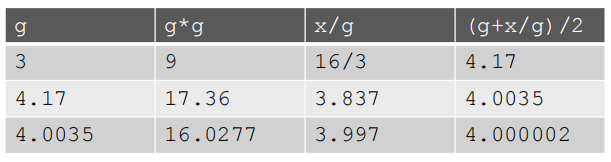
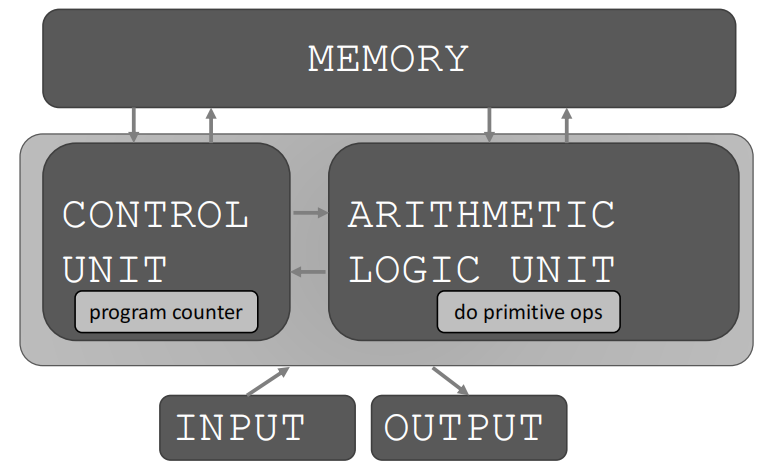

### What does a computer do?
- Fundamentally
    - performs calculations
    - remember results.
- What kind of calculations?
    - built-in to the language
        - very low level types of calculations
        - addtion, substraction, multiplication and so on.
    - ones that you define as the programmer
        - conbine primitive calculation types

### Computers only know what you tell them.
- They can not "understand" **declarative knowledge**
    - square root of a number x is y, such that y*y = x
- They can only "understand" **a recipe (imperative knowledge) **or "how to"
    - computers only do what you tell them to do.
    - recipe for deducing squre root of  a number x (16)
        -  start with a **guess**, g = 3
        -  if g*g is **close enough** to x
            - stop and say g is the answer
            - otherwise make a **new guess** g = ( g + x/g) / 2
        - use the new guess, repeat process until close enough



- What is a recipe?
    1. sequence of simple **steps**
    2. **flow of control** process that specifies when each step is executed
        - make decisions: Are we close engough?
    3. a means of determining **when to stop**
        - we decided we were close enough.
        - close enough was maybe being with 0.01
    - 1 + 2 + 3  = an algorithm
### How to capture a recipe in a mechanical process?
- **fixed program computer**
    - calculator
        - it only knows how to do addition, multiplication, substraction, division
        - can not plot things or send an email
- **stored program computer**
    - machine stores and excutes instructions(orders)



- Basic machine architecture
    - ALU Arithmetic Logic Unit
        - do really primitive operations: addtions, substraction, and so on
    - Memory
        - contains data
        - sequence of orders
    - Control Unit
        - contains a program counter
        - program counter
            - increase by 1 means that we're going to the next sequence in the instruction set
            - a particular instruction do some sort of test
                - depend on the result of that test
                - might go to the next instruction
                - or set the program counter to go all the way back to the beginning

### Basic primitives
- Alan Turing's six primitives
    - move left
    - move right
    - read
    - write
    - scan
    - do nothing
- modern programming languages have more convinent set of primitives
- can abstract methods to create new primitives
- anything computable in one language is computable in any other programming language

### Expressions
- Expressions are complex but legal combinations of primitives in a programming language
- primitive constructs
    - English: words
    - Programming Language:numbers, strings, simple operators
- syntax
    - English:
        - "cat dog boy" -> not syntactically valid
        - "cat hugs boy" -> syntactically valid
    - programming language
        - "hi"5 -> not syntactically valid
        - 3.2*5 -> syntactically valid
- static semantics is which syntactically valid strings have meanings
    - English:
        - "I are hungry" -> not syntactically valid
        - "I am hungry" -> syntactically valid
    - programming language
        - "hi"+5 -> not syntactically valid
        - 3.2*5 -> syntactically valid
- semantics is the meaning associated with a syntactically correct string of symbols with no static semantic errors
    - English:
        - can have many meanings
            - "Flying planes can be dangerous"
    - programming language
        - **have only one meaning but may not be what programmer intended**

### Where things go wrong
- syntactic errors
    - common and easily caught
- static semantic errors
    - some languages check for these before running program (Java)
    - can cause unpredictable behavior (JavaScript)
- no semantic errors but different meaning than what programmer intended
    - program crashes, stops running
    - program runs forever
    - program gives an answer but different than expected

### Python programs
- a program is a requence of definitions and commands
    - definition evaluated
    - commands executed by Python interpreter in a shell
- can be typed directly in a shell or stored in a file that is read into the shell and evaluated
- Objects
    - programs manipulate data objects
    - objects have a type that defines the kinds of things programs can do to them
        - scalar (cannot be subdivided)
            - 5 is an integer and can not be subdivided
            - int /float /bool /NonType
            - can yse type(a) to see the type of an object
        - non-scalar ( have internal structure that can be accessed)
            - [1,2,3,4,5] is a list of integers, is going to be a non-scalar object

- type conversions (cast)
    - float(3) convert integer 3 to float 3.0
    - int(3.9) truncates float 3.9 to integer 3
- use print() to show output from code to a user
- if you just input 3+2 and shell will return you "Out[xx]: 5"
    - "Out" tells you it's an interaction within the shell only
- Expressions
    - combine objects and operators to form expressions
    - an expression has a value, which has a type
    - syntax for a simple expression
        - `<object><operator><object>`
    - `+ - *`
        - if both are ints, result is int
        - if either or both are floats, result is float
     - `/` result is float
    - `%` the remainder when i is divided by j
    - `i**j` i to the power of j
- precedence
    - parenthese
    - without parentheses
        - `**`
        - `*`
        - `/`
        - `+ and -` executed left to right, as appear in expression
- equal sign `=`
    - is an assignment of a value to a variable name
    - value stored in computer memory
    - an assignment binds name to value
    - retrieve value associated with name or variable by invoking the name, by typing pi
- why give names to values of expressions?
    - to reuse names instead of values
    - easier to change code later
```
pi = 3.14159
radius = 2.2
area = pi*(radius**2)
radius = radius + 1
```
- changing bindings
    - can re-bind variable names using new assignment statements
    - previous value may still stored in memory but lost the handle for it
        - may be cleared by garbage collector
    - value for `area` does not change until you execute `area = pi*(radius**2)`again after re-binding
        - you have to tell the computer to do the calculation again